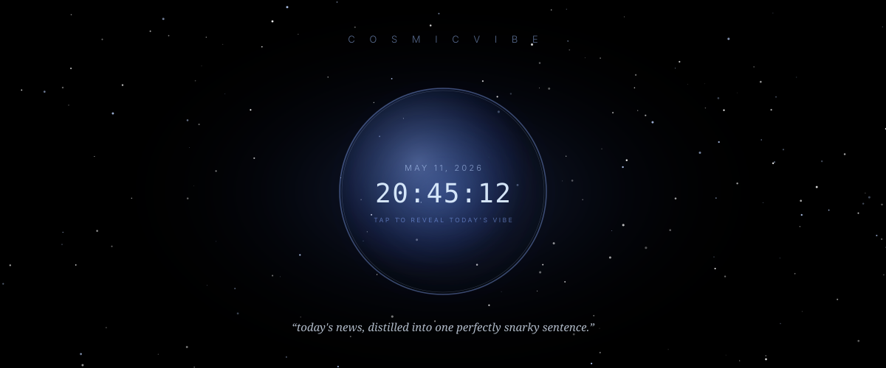

# Cosmic Vibe

<p align="center">
  
</p>

<p align="center">
  <em>An AI agent that scans the day's news and distills it into one perfectly snarky sentence.</em>
</p>

---

## What it is

Cosmic Vibe is a tiny single-file Python web app. You stare at a glowing pulsing orb showing the current date and time. You tap it. A few seconds later, the orb drifts up and a single italic sentence fades in below — a snarky, eye-catching summary of today's collective vibe, drawn from real news headlines you can click through to verify.

It runs entirely on your own machine: a local [Ollama](https://ollama.com/) model does the writing, and DuckDuckGo provides the news.

## How it works

The flow on every tap of the orb:

1. **Frontend** sends `POST /generate` to the local Flask backend.
2. **Backend** runs four parallel-style searches against DuckDuckGo News — `top news today`, `world news today`, `technology news today`, `politics news today` — and collects the headlines + source URLs.
3. **Headlines are handed to Ollama** as part of the prompt. The model is instructed to read the real headlines and write *one* perfectly snarky sentence that captures the collective vibe of the day. No tool-calling loop, no hallucinated news — the model only ever writes the punchline.
4. **Backend returns** `{ sentence, references }` as JSON.
5. **Frontend** transitions: the orb gently lifts, the sentence fades in, and the source list appears in a scrollable panel below — each item showing the article title and a clickable link to the source domain.

The whole thing is one Python file (`app.py`) with the HTML, CSS, and JavaScript embedded as a string. No build step, no node_modules, no framework.

### Architecture at a glance

```
┌─────────────┐    POST /generate     ┌──────────────┐
│  Browser UI │ ────────────────────▶ │  Flask app   │
│  (orb +     │ ◀──── { sentence,     │  (app.py)    │
│  starfield) │      references }     └──────┬───────┘
└─────────────┘                              │
                                             ├──▶ DDGS  (4 news searches)
                                             │
                                             └──▶ Ollama (llama3.2)
                                                  └─ writes the sentence
                                                     from real headlines
```

## Dependencies

### Runtime

- **[Python](https://www.python.org/) 3.10+**
- **[Ollama](https://ollama.com/)** running locally on `http://localhost:11434`
- An Ollama model with chat support — defaults to **`llama3.2:latest`** (~2 GB, fast). Swap to `gemma4:latest` (or any other chat model you have pulled) by editing the `MODEL` constant at the top of `app.py`.

### Python packages (`requirements.txt`)

| Package | Purpose |
|---|---|
| [`flask`](https://pypi.org/project/Flask/) | Tiny web server — serves the HTML page and the `/generate` JSON endpoint. |
| [`ollama`](https://pypi.org/project/ollama/) | Official Python client for the Ollama REST API. |
| [`ddgs`](https://pypi.org/project/ddgs/) | Maintained DuckDuckGo search client. Used for the news lookups that ground the model's sentence in real headlines. |

## Running it locally

### 1. Install Ollama and pull a model

Install Ollama from [ollama.com](https://ollama.com/) and pull the default model:

```bash
ollama pull llama3.2:latest
```

Make sure Ollama is running (it usually starts as a background service). You can verify:

```bash
curl http://localhost:11434/api/tags
```

### 2. Install the Python dependencies

```bash
cd cosmic-vibe
pip install -r requirements.txt
```

### 3. Run the app

```bash
python3 app.py
```

You'll see:

```
  Cosmic Vibe  ->  http://localhost:5000   (model: llama3.2:latest)
```

Open <http://localhost:5000> in your browser. Tap the orb. Embrace the void.

## Configuration

Open `app.py` and edit the constants at the top:

```python
MODEL       = "llama3.2:latest"          # any chat-capable model you've pulled
OLLAMA_HOST = "http://localhost:11434"   # change if Ollama lives elsewhere
```

If you're running this in WSL2 and Ollama is on the Windows host, `localhost:11434` will usually resolve correctly thanks to WSL2 networking. If not, use the Windows host IP instead.

## Project layout

```
cosmic-vibe/
├── app.py             # the entire app — backend + embedded frontend
├── requirements.txt   # python deps
├── assets/
│   └── banner.svg     # the readme banner
└── README.md
```

## License

MIT — go forth and be snarky.
